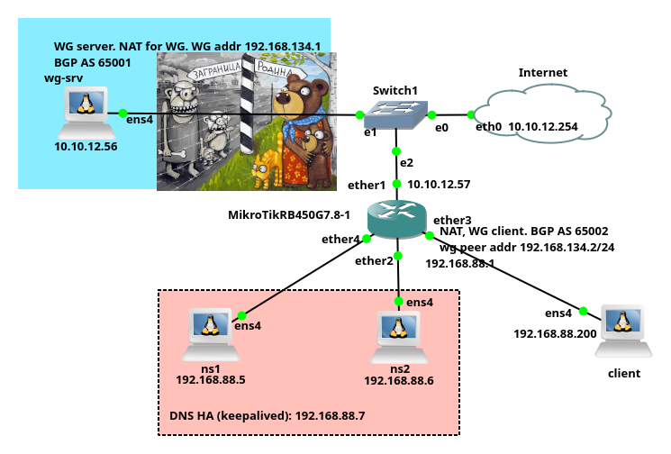

# Настройка анонса сетей по BGP с сервера Wireguard VPN
  
Есть список имён DNS из Интернета, которые должны с офисного маршрутизатора Mikrotik,
на котором рабтает клиент Wireguard, 
маршрутизироваться на сервер VPN Wireguard в Интернете, а не напрямую в Интернет по маршруту по умолчанию.  
В тестовой установке в GNS3 используются следующии версии:
- Сервер VPN: `Debian 12`
- Клиент VPN: `Mikrotik RB450G 7.8`
- Клиент, подключенный к Mikrotik: `Debian 12`

  

1. Установка bird на сервере VPN.
```bash
sudo apt install bird
```
2. Конфигурация `bird` на сервере VPN.
```bash
sudo nano /etc/bird/bird.conf
```
[Текст конфигурации](bird.conf)  
Для теста конфигурации создадим файл `/etc/bird/networks.conf`
```bash
sudo touch /etc/bird/networks.conf
```
Перечитываем конфигурацию bird:
```bash
sudo birdc configure
```
Проверяем:
```bash
journalctl -u bird --since "2 minutes ago"
```
```log
Jan 24 08:29:46 debian bird[927]: Reconfiguring
Jan 24 08:29:46 debian bird[927]: Reconfigured
```
Создадим список имён DNS, на сервере VPN.
Сети, к которым они относятся будут анонсироваться по BGP для маршрутизации через VPN.
```bash
sudo nano /hostnames
```
Примерное содержимое файла:
```plaintext
bbc.com
www.cnn.com
www.nvidia.com
bbc.com
# Это комментарий, он будет пропущен
x.com
```
Создадим программу для генерации списка сетей:
```bash
sudo nano /usr/local/bin/update_routes.py
```
[Текст программы](update_routes.py).  
Сделаем её исполнимой:
```bash
sudo chmod +x /usr/local/bin/update_routes.py
```
Запустим для проверки:
```bash
sudo /usr/local/bin/update_routes.py /hostnames
```
Проверяем:
```bash
journalctl -u bird --since "2 minutes ago"
```
Проверим список сформированных сетей для анонса по BGP:
```bash
sudo cat /etc/bird/networks.conf
```
Создадим файл сервиса systemd, который будет запускать программу `update_routes.py`
```bash
sudo nano /etc/systemd/system/update-routes.service
```
[Текст файла сервиса](update-routes.service).  
Перечитать конфигурацию systemd:
```bash
sudo systemctl daemon-reload
```
Пробуем запустить сервис:
```bash
sudo systemctl start update-routes.service
```
Смотрим статус:
```bash
systemctl status update-routes.service
```
Создадим файл таймера systemd, который будет запускать update-routes.service
каждые 5 минут
```bash
sudo nano /etc/systemd/system/update-routes.timer
```
[Текст файла таймера](update-routes.timer).  
Перечитать конфигурацию systemd:
```bash
sudo systemctl daemon-reload
```
Включить и запустить таймер:
```bash
sudo systemctl enable update-routes.timer
sudo systemctl start update-routes.timer
```
Проверить статус таймера:
```bash
systemctl list-timers
```
3. Установка Wireguard на сервере VPN
```bash
sudo apt install wireguard
```
Создайте приватный и публичный ключи для сервера:
```bash
sudo -i
umask 077
wg genkey | tee /etc/wireguard/privatekey | wg pubkey > /etc/wireguard/publickey
```
Создайте конфигурационный файл для интерфейса wg0:
```bash
sudo nano /etc/wireguard/wg0.conf
```
[Содержимое файла.](wg0.conf)  
Замените <ваш_приватный_ключ> на содержимое файла `/etc/wireguard/privatekey`  
Убедитесь, что файл конфигурации и ключи имеют правильные права доступа:
```bash
sudo chmod 600 /etc/wireguard/{privatekey,wg0.conf}
```
Включение IP-форвардинга. 
```bash
sudo nano /etc/sysctl.conf
```
Найдите и раскомментируйте строку:
```bash
net.ipv4.ip_forward=1
```
Примените изменения:
```bash
sudo sysctl -p
```
Включите интерфейс wg0 в автозагрузку при старте системы и запустите его:
```bash
sudo systemctl enable wg-quick@wg0
sudo systemctl start wg-quick@wg0
```
4. Настройка Mikrotik RB450 RouterOS 7.8  

Настройте интерфейс ether1 для получения параметров по DHCP:
```
/interface ethernet
set ether1 name=ether1
/ip dhcp-client
add interface=ether1
```
Создайте мост bridge1 и добавьте в него интерфейсы ether2-ether5:
```
/interface bridge
add name=bridge1
/interface bridge port
add bridge=bridge1 interface=ether2
add bridge=bridge1 interface=ether3
add bridge=bridge1 interface=ether4
add bridge=bridge1 interface=ether5
```
Настройте DHCP-сервер для выдачи адресов клиентам в сети bridge1. Например, пул адресов 192.168.88.0/24:
```
/ip pool
add name=dhcp_pool ranges=192.168.88.100-192.168.88.200
/ip dhcp-server
add interface=bridge1 address-pool=dhcp_pool disabled=no
/ip address
add address=192.168.88.1/24 interface=bridge1
/ip dhcp-server network
add address=192.168.88.0/24 gateway=192.168.88.1 dns-server=192.168.88.1
```
Включите маскарадинг для трафика, исходящего через ether1:
```
/ip firewall nat
add chain=srcnat out-interface=ether1 action=masquerade
```
Включите DNS-сервер и настройте его для кэширования:
```
/ip dns set allow-remote-requests=yes servers=77.88.8.8,77.88.8.1
```
На всякий случай сохранить конфигурацию:
```
/system backup save
```
5. Настройка клиента wireguard на Mikrotik и добавление его на сервер.  
Сгенерируем на хосте ключи для клиента Wireguard на Mikrotik.
```bash
wg genkey | tee mikrotik-privkey | wg pubkey >mikrotik-pubkey
```
Создайте интерфейс WireGuard и настройте его:
```
/interface/wireguard/add name=wg-vpn private-key="приватный_ключ_mikrotik"
/ip/address/add interface=wg-vpn address=192.168.134.2/24
```
Добавление пира (сервера WireGuard)
```
/interface/wireguard/peers/add interface=wg-vpn public-key="yrtk6Uas3SvUmeJHU8wNvHsIzyNTcJB8JxYRKYaoPyU=" allowed-address=0.0.0.0/0 endpoint-address=10.10.12.56 endpoint-port=51820
```
Включение маскарадинга на интерфейсе wg-vpn:
```shell
/ip/firewall/nat/add chain=srcnat out-interface=wg-vpn action=masquerade
```
Добавление клиента wireguard на сервер
```bash
sudo nano /etc/wireguard/wg0.conf
```
Добавить peer
```conf
[Peer] # MikroTik RB450G7.8-1
PublicKey = публичный_ключ_клиента
AllowedIPs = 192.168.134.2/32
```
Перезапустить сервер VPN
```bash
sudo systemctl restart wg-quick@wg0
```
Старт клиента wireguard на Mikrotik
```
/interface/wireguard/enable wg-vpn
```
Просмотр статуса интерфейса wireguard
```
/interface/wireguard/print
```
Пробуем пинговать сервер wireguard
```
/ping 192.168.134.1
```
Сохраняем конфигурацию
```
/system backup save
```
6. Настройка BGP на Mikrotik  
Создайте шаблон для BGP:
```shell
/routing bgp template add name=bgp-template-1 as=65002 router-id=192.168.134.2
```
Добавьте соединение с соседом (peer) с адресом 192.168.134.1 и AS 65001:
```shell
/routing bgp connection add name=bgp-connection-1 template=bgp-template-1 remote.address=192.168.134.1 remote.as=65001 local.role=ebgp local.address=192.168.134.2
```
После настройки проверьте состояние BGP:
```shell
/routing bgp session print
```
Проверьте, что маршруты от соседа получены:
```shell
/routing route print where bgp
```
Сохраняем конфигурацию
```
/system backup save
```
Проверяем работу.  

С клиента, подключенного к клиенту Wireguard(Mikrotik), запускаем traceroute
к сайту, из списка /hostnames:
```bash
traceroute www.cnn.com
```
Вывод:
```
traceroute to www.cnn.com (151.101.67.5), 30 hops max, 60 byte packets
 1  _gateway (192.168.88.1)  2.585 ms  1.308 ms  1.299 ms
 2  192.168.134.1 (192.168.134.1)  4.286 ms  2.913 ms  2.936 ms
 3  10.10.12.254 (10.10.12.254)  3.664 ms  3.019 ms  3.458 ms
 4  10.0.10.251 (10.0.10.251)  31.007 ms  29.680 ms  29.417 ms
 5  91.224.63.65 (91.224.63.65)  29.164 ms  28.914 ms  28.667 ms
 6  mskn17ra.transtelecom.net (217.150.38.150)  27.099 ms  5.712 ms  3.724 ms
 7  ipv4.de-cix.fra.de.as20485.ttk.ru (80.81.194.117)  50.799 ms  48.022 ms  46.945 ms
 ...
```
Идёт через VPN - 192.168.134.1  

Проверяем traceroute к хосту не из списка /hostnames:
```bash
traceroute www.rbc.ru
```
Вывод:
```
traceroute to www.rbc.ru (178.248.234.119), 30 hops max, 60 byte packets
 1  _gateway (192.168.88.1)  2.570 ms  1.391 ms  1.031 ms
 2  10.10.12.254 (10.10.12.254)  2.507 ms  1.995 ms  2.197 ms
 3  10.0.10.251 (10.0.10.251)  3.717 ms  24.330 ms  21.817 ms
 4  91.224.63.65 (91.224.63.65)  20.644 ms  19.953 ms  19.267 ms
 5  mskn17ra.transtelecom.net (217.150.38.150)  18.361 ms  17.909 ms  16.950 ms
 6  mskn06.transtelecom.net (188.43.15.238)  16.288 ms  6.416 ms  5.744 ms
 7  HLL-gw.transtelecom.net (188.43.15.237)  3.554 ms  3.869 ms  3.111 ms
...
```
Идёт напрямую.

TODO: DNS-клиенты, подключенные в разных географических местах, могут получать разрные адреса при запросах.
Чтобы этого избежать надо настроить клиента DNS на сервере VPN соответствующим образом.  

TODO: Настроить firewall на сервере VPN и на Mikrotik